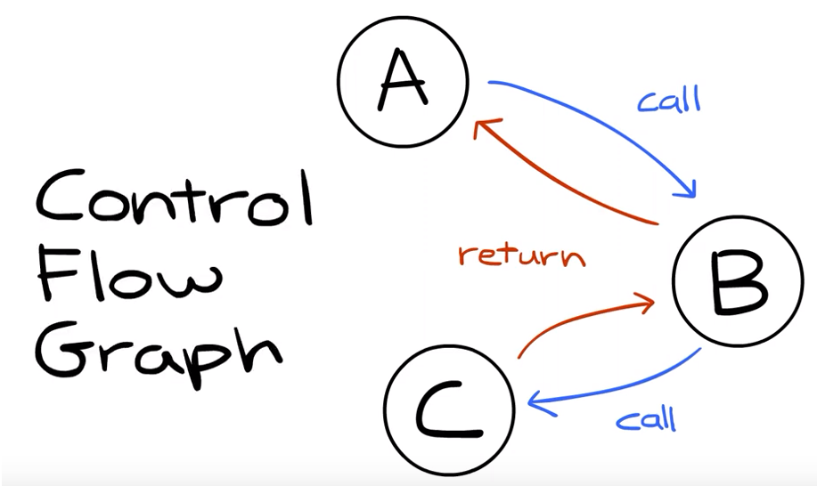
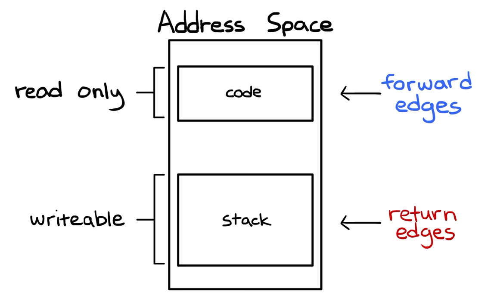

# cpt.system.shadow_stack

Provide a check for the integrity of a return address

## Overview

The **shadow stack** is a separate stack to your programs
stack, that holds copies of the return addresses from
the original stack

It prevents [buffer overflow](./b3a1.md) attacks by providing a
check **before using** a return address, in the normal
case the return address is going to be equal to the
one in the shadow stack

If it however has been compromised the return address
values between the normal and the shadow stack will
not match and the program will crash

> It's a strong defense because it's checking for the
> validity of the return address itself

This way we enforce **control flow integrity** by
checking the integrity of the return `edges` in a
control flow `graph`

 

- `Return edges` rely on return addresses, since a function
  that may be called from different context can only
  know where to return to at run time

- `Call edges` (forward edges) are, usually, determined before 
  the program is run, when the call its' being hard-coded, and 
  thus they are naturally protected

This is because the data for the `return edges` is stored in 
the `stack` section of the `adress space` which is `writeable` and the
data for the `forward edges` is stored in `code` section which is
a `read only` section

 
