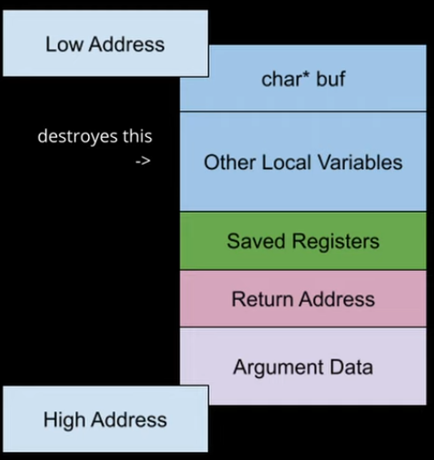

# cpt.system.buffer_overflow

When the amount of data written to a buffer exceeds it's capacity

## Overview

This is a common mistake when taking some external input, into a
pre allocated buffer

For example say you create a `char` buffer like `char buff[10]` and
then you read some data into it. If you don't check that the 
amount of data that it's about to be written into the buffer, 
does not exeeds the buffer capacity, or you don't use a function 
that writes up to a limit.

This results in a **buffer overflow** where the input can overwrite
other data in the functions `stack frame` and corrupt othe local
variable data, 

 

If a malicious user inputs enough characters they can even overwrite 
the functions `return adress`, meaning that they can redirect execution
of the program to a different section of code thats possibly malicious
as well
