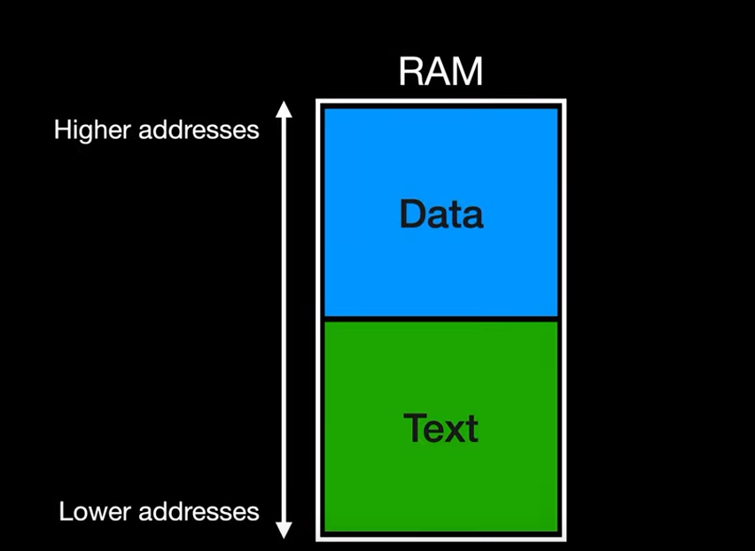
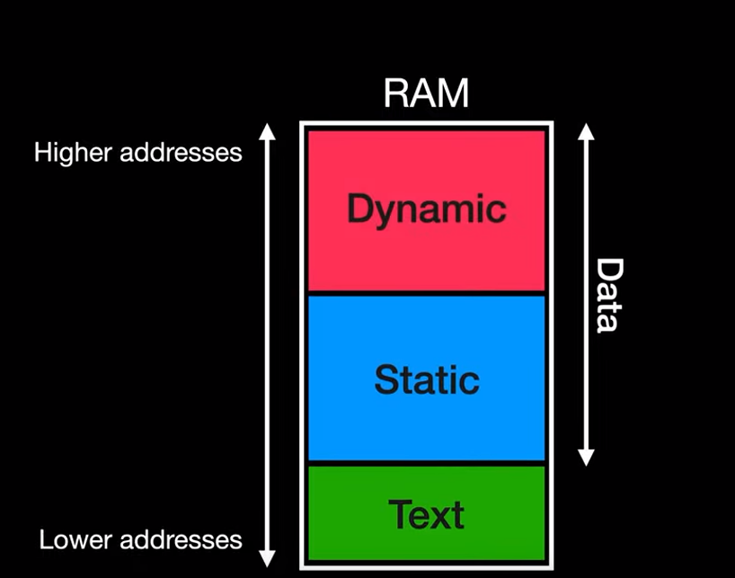
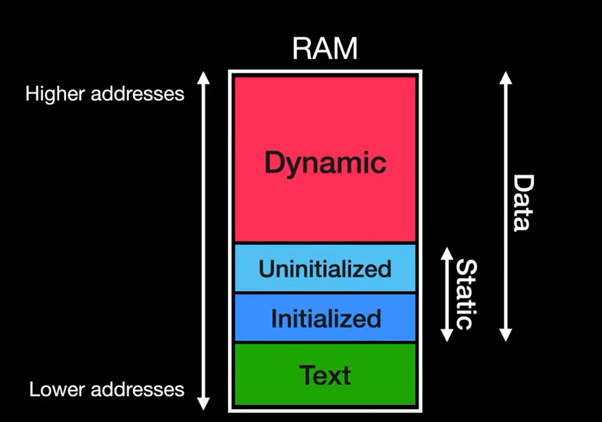
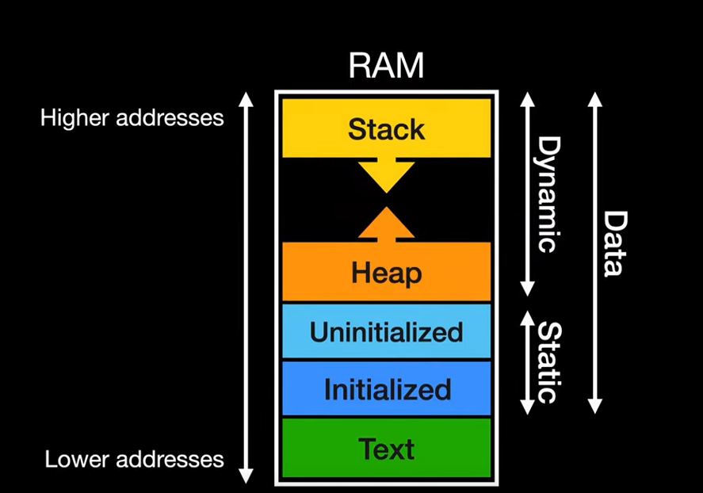
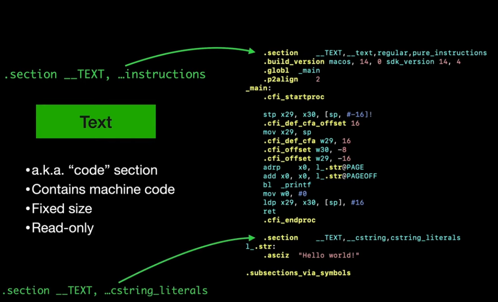
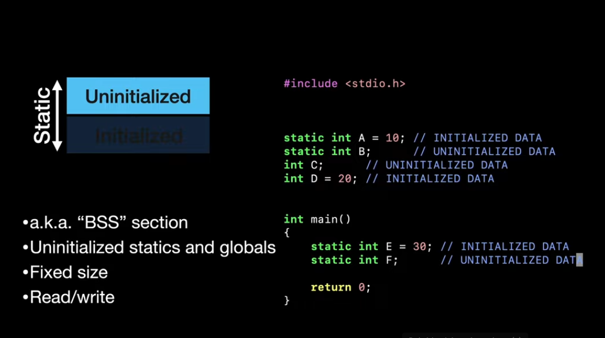
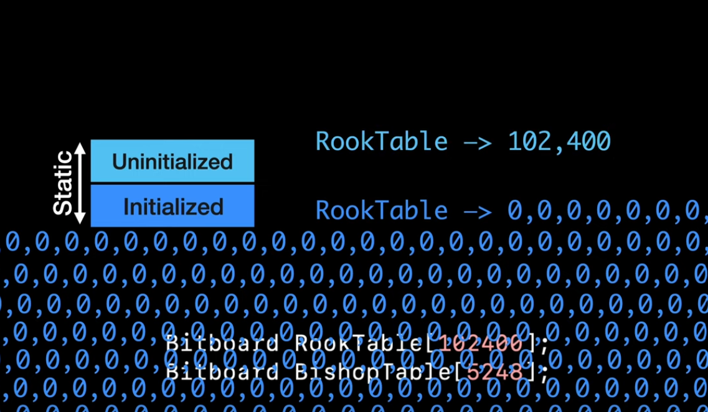
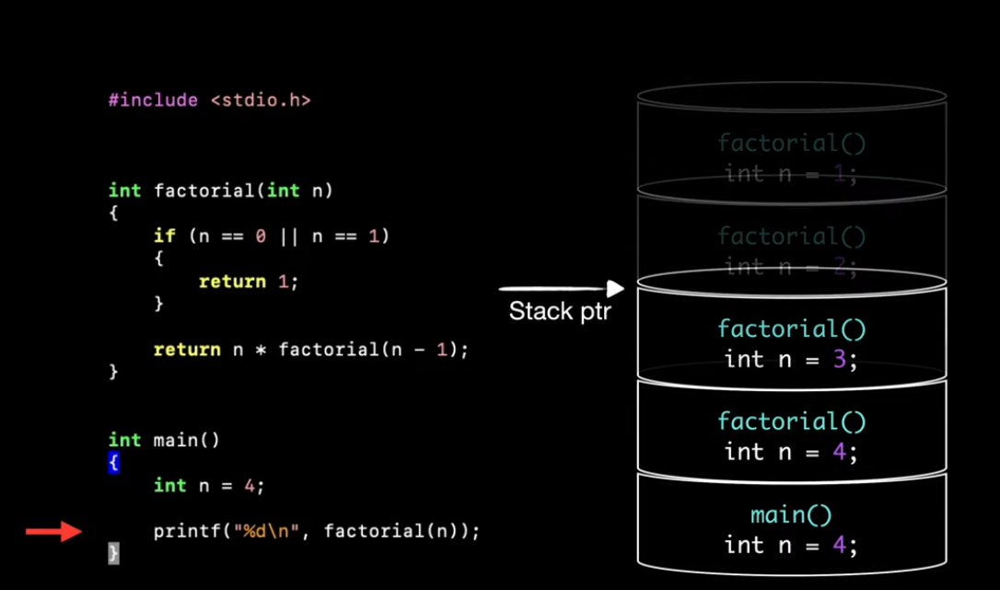

# cpt.system.memory_segments

Anatomy of the memory segmentation assigned to a process

## Overview

Here we will describe how your `c` program will be
laid out in memory after is loaded as an executable

In general terms, memory can be divided into a 
**text** and a **data** segment.

 

Further more the data segment can be divided into 
**dynamic** and **static** data

 

And so, static data can be grouped into **initialized** 
and **un-initialized** static data

 

Finally, dynamic data is divided into two **data structures** 
the `stack` and the `heap`

 

## Memory segments

### Text segment

Is also known as the `code` segment, it contains the 
instructions, machine code, for executing the program 
and it's **read only**

It's also of a **fixed size** and is read directly from
the `executable`, and contains any `string literals`
present in your code

 

### Static initialized memory segment

The initialized segment, holds **initialized global** and
`static` [variables](./e6e6.md), this have set values in the code.

And this segment is also read directly from the executable
and it has a fixed size.

However it's also **read/write** accessible, meaning that
the data in the segment can be modified

### Static initialized memory segment

Also known as the `BSS` segment, it stands for 
**Block Started by Symbol** and it holds **un-initialized** 
global and `static` variables

The `assembly` directive `BLK` (or block) initializes a
block of memory to `zero`, so all the data in the
`BSS` segment is initialized to `zero`

 

This separation between un-initialized and initialized
is done so that we don't have to store data that is
just going to be full of `0` values inside the executable

And so the `BSS` can just store the size of the data
and the `0` values are implicit

 

### The heap memory segment

Unlike the other memory segments, this is variable in
size, and so it can grow and shrink as the program
runs

It's our responsibility as programmer to handle how
we manage this memory segment and can be useful for
data structures whose size can't be known at compile
time

### The stack memory segment

It manages:

- Function calls
- Local variables
- Input arguments

It mimics the `stack` **data structure** where things
can be accessed only from the top with a `LIFO`
(last in, first out) behavior

When a [function](./nt45.md) is called, it's local variables and
arguments are pushed onto the top of the stack, and
the location of this new data is kept track by the
`stack pointer`

And when the function returns, it's stack frame is
popped from the top of the stack, so any variables
there were assigned there may not be reachable
later on

 
