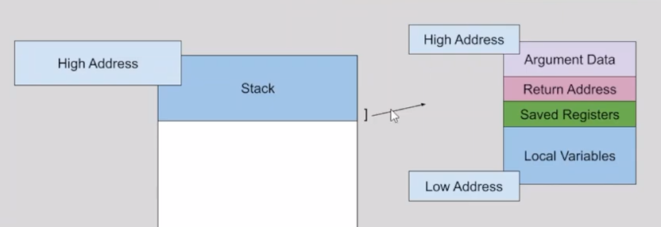

# cpt.system.stack_overflow

When a process uses more than it's allocated stack space

## Overview

This is a special kind of [segmentation faul](./y9qw.md) that
happens when a `process` uses more than it's allocated
`stack` space

This most commonly occurs when a process makes to many
nested or recursive `function` calls, which ends up
creating too many function frames to fit inside the
allocated `stack` space

 

It can allso occur when you allocate too much memory
on the `stack`, with a function like [alloca](./77ao.md) 
(Ex. `alloca(123456789ull);`)

In either case, the program tries to access memory
pass the `adressable stack` and triggers a `segfault`
