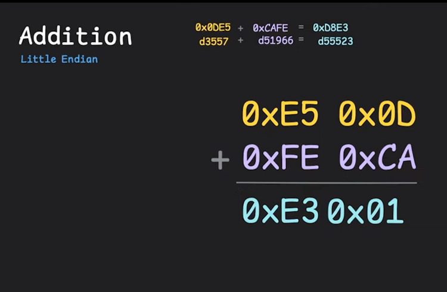
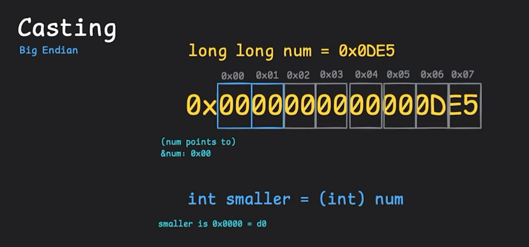
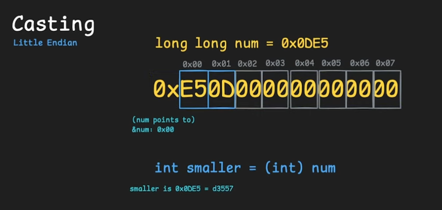

# cpt.system.endianness

The way in which machines store multi byte data

## Overview

When a machine stores multi byte data such as a
`32` bit integer. It needs to decide in what order
it's going to store the consecutive bytes

This is necessary because the whole of the information
can't be packed in `8` bits, and it can't be analyzed
byte by byte either. The information needs to be
decoded as a whole

> Keep in mind that endianness is mostly a hardware
> concern and for most developers on the same machine
> it should not matter

For example, given a `32` bit integer expressed in
[hex](./4gzy.md) as `0xa01183d1` (which is `4` bytes), It could
store it in one of two ways

- `Little endian`: Least significant bits first
- `Big endian`: Most significant bits first

### Big endian systems

In this type of hardware systems multi byte data is
laid out starting from the **most significant** byte
of the data

The **most significant byte** in this case refers to
the byte that represent what would be the most amount
of data

For example take the number `512` here the **most
significant digit**  would be `5` since it actually
represents the number `500`. And in the case of a `32`
bit integer, the first byte would represent the bits
with the higher powers of `2` in [binary](./acl6.md) 

So for the case of `0xa01183d1`, the bytes would be
stored as:
  - First byte `a0`
  - Second byte `11`
  - Third byte `83`
  - Fourth byte `d1`

### Little endian systems

In this type of hardware systems multi byte data is
laid out starting from the **least significant** byte
of the data

So for the case of `0xa01183d1`, the bytes would be
stored as:
  - Frist byte `d1`
  - Second byte `83`
  - Third byte `11`
  - Fourth byte `a0`

From the programmer perspective for most cases this 
would be of no concern since the hardware will re-arrange
them when they need to be read

The only problem would be when using a [debugger](./1nja.md) and you
are trying to inspect each individual byte of the data
since then they would be presented in their original
layout and you would need to make that adjustment your
self

### Why would little endian be used

There is no fully legitimate reason why one would be 
preferred over the other, but due to convention most systems
will use the little endian (expect for networking)

This is mostly for historic reasons, but there are some
possible algorithms and situation where little endianness
can be useful

#### When adding up multi byte numbers

If you have an architecture that is capable of doing additions
while retrieving bytes at the same time, then having the
least significant bytes first is rather useful since any
number that has to be carried over we can assign into memory
and add on later when we add the next bytes.

 

Furthermore this can be done so without having to back track 
and modify previous bytes, which you would have to do if
you add up bytes starting from the most significant bytes

> This is similar to how we perform additions as humans, we
> start from the most right side of the numbers

#### When re-casting number to lower byte stores

Image the case where you have a very big number type that
actually holds a very small number, since the pointer to the
multi byte value only points to the first byte, if you
recast it to smaller value you might end up only taking the
first zero values

 

However in a little endian system you can at least take some
of the bytes and get the correct number if they fit into
your new type

 

> This is very system dependent and some may do tricks to still
> get the value even if it's big endian

### Endianness when communicating between computers

The most common point when the endianness of a system
becomes of a concern is when 
  - Communicating between computers
  - Reading external files or network data

Since for computer to computer communication we need to
agree at a protocol level what will be the endianness of
used, since other wise it could lead to each some machines
interpreting the data as something completely else

And the same when reading external files or network data
since the data in the file might've been laid out by a 
computer with a different endianness, there for in most
binary formats an endianness is decided in the specifications,
so then both machines that write and read from that format
need to do their conversions if necessary

### Non multi byte data and endianness

Endianness is not relevant for data that is not multi byte,
for example in the case of [strings](./jfth.md) since, like how it is
on c, they are already represented as an array of bytes where
each character is an `8` bit number

## Cookbook

### How to tell if your system works with little or big endian

In `c` you can tell if your systems works with little or
big endian values by one of two ways

If the macro is defined

Other wise you can do it the manual way, by creating an
`int` value of `1` (which is garanteed to be at least two `bytes` 
long), getting the [pointer](./rmf8.md) to the value, and recasting
it to be a `char *`, this is so we only read **at most** one
`byte` when `de-referencing` it.

If the dereferenced value of the `char *` is equal to `1`
then we are working with a little endian system, otherwise
if it's equal to `0` then we are working with a big endian
system

```c
#include <stdio.h>

int main(int argc, char *argv[]) {
  int test = 1;

  char *value_char = (char *)(&test);

  switch (*value_char) {
  case 1:
    puts("The system is litttle endian");
    break;
  case 0:
    puts("The system is big endian");
    break;
  }

  return 0;
}
```
