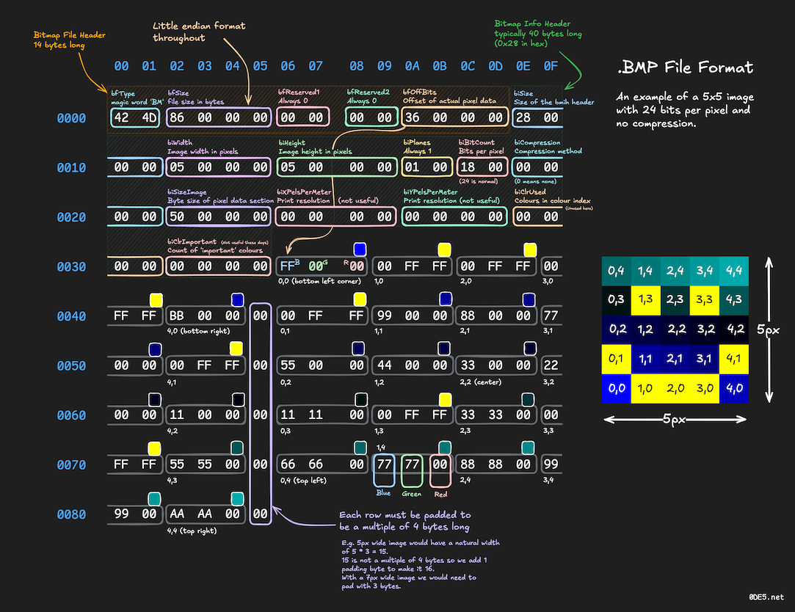

# spec.img.bit_map

The specs of the bit map image format

## Overview

## Cookbook

### Cheat sheet reference of the simple bit map file format

This a very simple reference image of the bit map
file format, though there are many variations of the format
this is a basic guide for quick review

 
